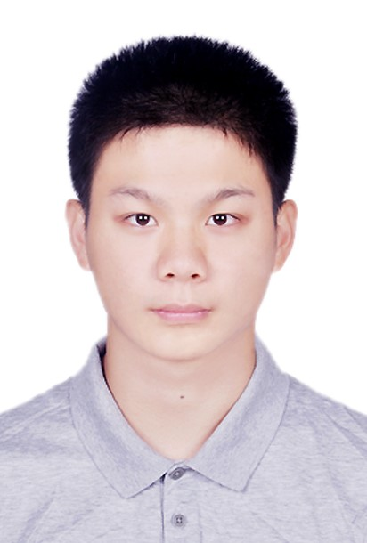
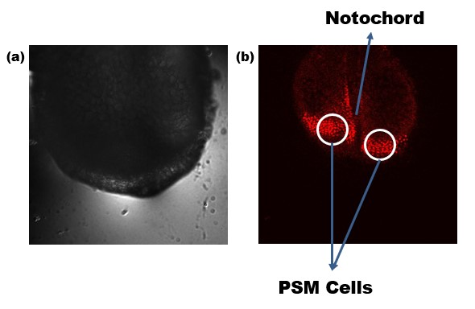
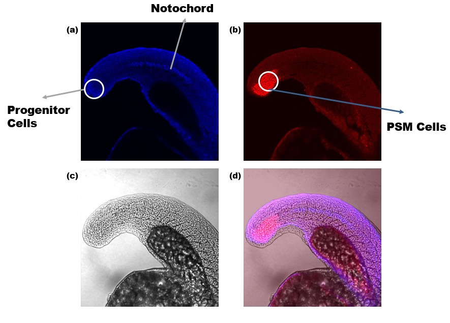
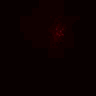
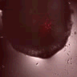
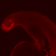
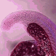
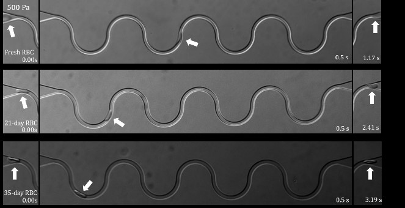
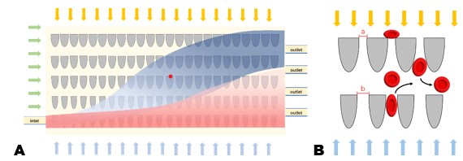

<table border="0">
  <tr>
    <td width="75%">
      <h1>Yiyang Chen</h1>
      
<b>B.S. in Physics</b>

      
<b>School of Physics, Nankai University</b>

      
<b>NO.94 Weijin Road, Nankai District, Tianjin, China, 300071</b>

      
<b>Email: <a href="mailto:yychen@mail.nankai.edu.cn">yychen@mail.nankai.edu.cn</a>/<a href="mailto:yychen.nku@outlook.com">yychen.nku@outlook.com</a> </b>

      
<b>Phone: (+86)18737183786 </b>

      
<b><a href="cv_YiyangChen.pdf">CV</a> </b>

     </td>
       <td width="25%">
         
       </td>
       </tr>
</table>

## EDUCATION
### Nankai University, NKU
　　B.S. in Physics (Hornors Degree)，GPA: 85.82/100

　　Boling Class of Physics, supported by The Pilot Scheme of Talent Training in Basic Sciences
  
## RESEARCH EXPERIENCES
### University of Michigan - Ann Arbor
#### Immunofluorescent Biomarker for Zebrafish Somitogenesis and Single-cell Oscillation

***Research Assistant***, 07/2019-09/2019, Ann Arbor, United States

Department of Biophysics, Supervisor: [Qiong Yang](http://www-personal.umich.edu/~qiongy/)

- Developed two-color immunofluorescent protocols for Ntla and Tbx16 in both zebrafish embryos and cell dispersals to identify the types of oscillating cells and non-oscillatory cells removed from the tailbud
- Determined different experimental conditions for embryo and cell dispersion systems after continuous trails
- Distinguished oscillating cells in different phenotypes: PSM, Progenitor, and Somite by the common images and Z-stack images taken by confocal microscope
- Left the images with good experiment results for lab use

    
    
One-color immunofluorescence for Tbx16(red)

 
 

    
    
Two-color immunofluorescence for Tbx16(red) and Ntla(blue)

 
 

Z-stack images:

<table>
   <tr>
        <td>
Tbx16
</td>
        <td>
Overlapped with bright field
</td>
    </tr>
  
  </table>
  
<table>
  <tr>
        <td>
Tbx16
</td>
        <td>
Ntla
</td>
        <td>
Overlapped with bright field
</td>
    </tr>
  
  </table>
  
   
   
  
  Poster about this research work is published on **2020 APS March Meeting** [<a href="poster_zebrafish.pdf">pdf</a>]
  
  
  
### Nankai University
#### Sorting Human Erythrocytes in Different Life Stages based on Microfluidic Technology

***Project Leader***, *National College Students Innovation and Entrepreneurship Training Program*, 04/2019-03/2021, Tianjin, China

School of Physics, Supervisor: [Leiting Pan](http://panltlab.org/)

- Investigated the influence of erythrocyte aging process on the deformability decrease
- Conducted human erythrocyte deformability measuring and hydrodynamic cell sorting based on microfluidic channels
- Artificially controlled the life stages by storing in vitro and processed the erythrocyte by *hydrogen peroxide* treatment to change the erythrocyte deformability and prepare for the chip test of cell sorting
- Revised and designed the microfluidic ratchet chip to complete the cell sorting

    
    
Human RBCs of different life stages travel through the meandering channel: the difference of speeds shows the influence of RBC aging process to deformability decrease

  
  

    
    
Schematic of Microfluidic Ratchets

  
  

Poster about this research work is posted as a course task of  **Training of Research Ability Ⅲ** [<a href="poster_microfluidics.pdf">pdf</a>]

#### Property Research of Human Erythrocyte Skeleton and Membrane Protein CD47 Based on Stochastic Optics Reconstruction Microscopy (STORM)

***Research Assistant***, 07/2018-09/2018, Tianjin, China

School of Physics, Supervisor: [Leiting Pan](http://panltlab.org/)

- Accepted the basic training on STORM imaging, immunofluorescent experiments and Matlab algorithms
- Assisted Ph.D. students in analyzing the raw data of CD47 protein diffusion, and optimizing algorithms and parameters to reduce the difference between the processed image and the original experimental data

## COURSE PROJECT
### Nankai University
**Study and Discussion of Physics 4-2**, Professor: Qiang Wu, 03/2018-06/2018

Project: ***Light Transmission in Sub-wavelength Dielectric Waveguide***, Supervisor: Qian Sun

- Investigated plasmon transmission on the surface of the metallic waveguide and light transmission mode and light field distribution in the anisotropic sub-wavelength waveguide
- Researched theories and simulated anisotropic cladding’s effect on decreasing the loss brought by evanescent wave

## ACADEMIC ACTIVITIES
**Medical Physics Summer School**, Duke Kunshan University(DKU), 08/09/2020-08/14/2020

**The Physics of Life Online Summer School**, Princeton University, 06/15/2020-08/03/2020, [Webpage](https://biophysics.princeton.edu/cpbfsummerschool2020)

## SELECTED POSTER
*Immunofluorescent Biomarkers for Distinguishing Cell Phenotypes in Zebrafish Somitogenesis and Autonomous Cellular Oscillators* published on **2020 APS March Meeting** [<a href="poster_zebrafish.pdf">pdf</a>]

## MEMBERSHIP
*Student Member*, **the Optical Society of America(OSA)**, OSA Nankai University Student Chapter, 04/2018-03/2020

## TEACHING EXPERIENCES
**Basic Physics Ⅲ** and **Basic Physics Ⅳ** (Boling Class of Biology), NKU, 09/2019-01/2020

*Teaching Assistant*, Professor: Jianghong Yao

- Helped the professor mark homework and exams, explained homework exercises, answered questions during tutorials and the review classes
